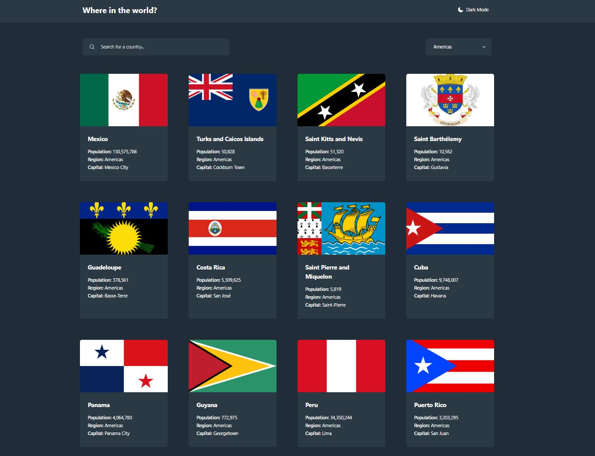
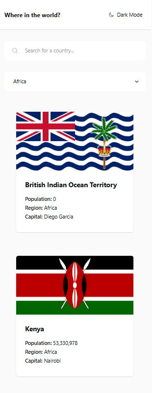
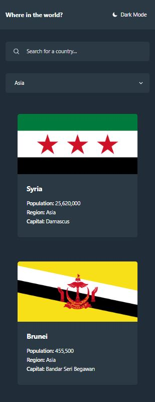

# Mod 7 Project: Frontend Mentor - REST Countries API with color theme switcher

This is a solution to the [REST Countries API with color theme switcher challenge on Frontend Mentor](https://www.frontendmentor.io/challenges/rest-countries-api-with-color-theme-switcher-5cacc469fec04111f7b848ca) which is my module 7 project.

## 📋 Table of Contents

- [Overview](#overview)
  - [The challenge](#the-challenge)
  - [Screenshot](#screenshot)
  - [Links](#links)
- [My process](#my-process)
  - [Built with](#built-with)
  - [What I learned](#what-i-learned)
  - [Continued development](#continued-development)
  - [Useful resources](#useful-resources)

## 🧐 Overview

This project is a REST Countries Explorer where users can browse and search for countries, view detailed information about each country, and filter countries by region. It also supports dark and light theme modes. When a country card is clicked, the app displays a detailed view with population, region, capital, native name, and border countries. The interface is responsive and works on both mobile and desktop screens.

The app was built using TypeScript, Vite, and Tailwind CSS. I used the REST Countries API to fetch and display country data. Tailwind handled all the styling including dark mode support, and Vite served and bundled the project for fast development and builds. TypeScript was used throughout the project to help with types, API responses, and cleaner logic. Event delegation was used for handling user clicks on dynamically generated elements. Data fetching and rendering were separated to keep the code organized and easier to update. Caching was added to avoid repeated API requests and improve performance. The app was deployed with Vercel and can be visited [here](https://millanfig-rest-countries-api.vercel.app/).

### 🎯 The Challenge

#### Users should be able to:

[x] See all countries from the API on the homepage 
[x] Search for a country using an `input` field 
[x] Filter countries by region 
[x] Click on a country to see more detailed information on a separate page 
[x] Click through to the border countries on the detail page 
[x] Back to list button functinality 
[x] Update moon icon on theme toggle 
[x] Toggle the color scheme between light and dark mode 
[x] App should be deployed to static site hosting service (Vercel, Netlify)

### 📸 Screenshots

  
  

### 🔗 Links

- Solution URL: [https://github.com/millan-figueroa-pscoursework/rest-countries-api/](https://github.com/millan-figueroa-pscoursework/rest-countries-api/)
- Live Site URL: [https://millanfig-rest-countries-api.vercel.app/](https://millanfig-rest-countries-api.vercel.app/)

## 📐 My Process

- Planned the file structure first to organize where everything would live in the project
- Created a To-Do.md file and used it to track tasks throughout development
- Set up TypeScript interfaces and practiced fetching data from the REST Countries API
- Began by rendering the country grid in main.ts, then added search and region-filtering functionality
- Built the detail-view rendering functions in ui.ts and later moved the grid rendering functions there as well to keep UI logic together
- Made frequent commits and pushed updates often, writing clear commit messages to document my progress and thinking
- Every time I built a function I made sure to hook it up to the event listener and checked with a quick console.log to make sure its hooked up properly before struggling with the logic
- Every time I began styling an element I did a sanity check (bg:red)
- Styled the app as I went, although next time I want to separate logic and styling and finish all styling at the end
- Deployed to Vercel

### ⚙️ Built With

- Typescript
- Vite
- Tailwindcss
- NodeJS

### 🎓 What I learned

While building this project, I learned a lot about how to organize code and structure an app. At first I just wanted to fetch data and show it, but quickly realized I needed good separation of concerns. I kept my app logic, UI rendering functions, interfaces, error handling, and data fetching in its own files. This made everything easier to follow and fix. I also set global color variables for Tailwind, which helped keep styling consistent. This latest version of Tailwind works smoothly with Tailwind which saved a lot of time compared to previous versions.

I’m glad I stuck with TypeScript. Using it on this project helped me learn about object shapes, generics, and stuff I hadn't heard about before like the Record utility type, and that helped me type API data properly. I also got more familiar with event delegation, especially for handling clicks on dynamically generated country cards. One challenge was working with the API limit rate, not showing border countries in the detail view. I solved it by refactoring and caching data so I didn’t keep calling the API over and over, which made the app faster and saved requests. TS Record types came in handy to create and object to convert country codes to actual names.

### ⏩ Continued development

I would definitely refactor to use React, as it would be perfect for this app. I also want to keep practicing structuring code and using TypeScript types to make my apps more reliable and easier to maintain.

### 📚 Useful resources

- [MDN](https://developer.mozilla.org/en-US/)
- [REST Countries API](https://restcountries.com/#endpoints-all)
- [Tailwindcss Docs](https://tailwindcss.com/docs/installation/using-vite)
